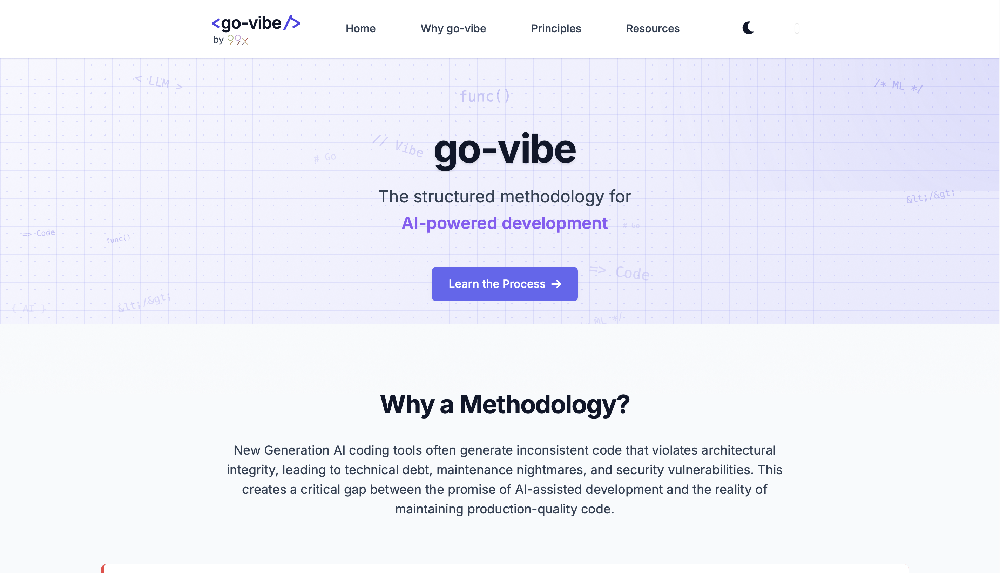

<div align="center">
  
  
  # go-vibe
  
  **A structured methodology for maximizing ROI from AI-assisted development**
  
  [Website](https://go-vibe.dev) • [Documentation](./docs/overview.md) • [Contributing](./contributing.md)
</div>

---

## 📋 What is go-vibe?

go-vibe is a comprehensive development methodology designed to bridge the gap between the promise of AI-powered coding tools and the reality of maintaining production-quality code. In an era where AI coding assistants (like Cursor, GitHub Copilot, and Claude) are becoming increasingly powerful, teams face critical challenges:

- **Inconsistent code quality** across AI-generated outputs
- **Architectural integrity violations** leading to technical debt
- **Context window limitations** affecting large codebases
- **AI hallucinations** producing incorrect or misleading code

go-vibe solves these problems by providing a **structured, iterative approach** that combines AI-assisted development with robust documentation and code generation best practices.

## 🎯 Core Principles

go-vibe is built on four fundamental pillars:

### 1. **IDE Rules** 
Define and enforce custom coding patterns and standards through AI IDE configurations (e.g., Cursor rules). Ensures consistent code style and architecture compliance.
[Learn more →](./docs/ide-rules.md)

### 2. **Documentation Creation**
Generate and structure documentation as a single source of truth for both humans and AI. Well-documented code enables AI to make better decisions and maintain architectural integrity.
[Learn more →](./docs/doc-creation.md)

### 3. **Code Generation**
Leverage AI-powered code generation effectively by providing optimal context, following workflow recommendations, and employing strategic development patterns.
[Learn more →](./docs/code-generation.md)

### 4. **Documentation Evolution**
Keep documentation synchronized with code changes through systematic updates, AI-assisted maintenance, and team accountability.
[Learn more →](./docs/doc-evolution.md)

## 🚀 Getting Started

### Prerequisites
- Modern web browser (Chrome, Firefox, Safari, Edge)
- Interest in AI-assisted development methodologies

### Local Development

1. **Clone the repository:**
   ```bash
   git clone https://github.com/99x-Internal/go-vibe.dev.git
   cd go-vibe.dev
   ```

2. **Open the website:**
   ```bash
   # Simply open index.html in your browser, or serve it locally
   python3 -m http.server 8000
   # Visit http://localhost:8000
   ```

3. **View the documentation:**
   - Start with [Overview](./docs/overview.md)
   - Explore individual methodology docs in the `docs/` directory

## 📁 Project Structure

```
go-vibe.dev/
├── index.html              # Main website landing page
├── src/
│   ├── css/
│   │   └── main.css       # Responsive styling & theming
│   ├── js/
│   │   └── main.js        # Interactive features (dark mode, navigation)
│   └── images/            # Logo and assets
├── docs/
│   ├── overview.md        # go-vibe methodology overview
│   ├── ide-rules.md       # IDE configuration guide
│   ├── doc-creation.md    # Documentation best practices
│   ├── doc-evolution.md   # Documentation maintenance
│   └── images/            # Documentation diagrams
├── assets/
│   └── video_scripts/     # Supplementary content
├── contributing.md        # Contribution guidelines
└── README.md             # This file
```

## 💻 Technology Stack

- **HTML5** - Semantic markup
- **CSS3** - Responsive design with CSS custom properties (variables)
- **Vanilla JavaScript** - No framework dependencies
- **Font Awesome** - Icon library
- **Google Fonts** - Typography (Inter, Fira Code)
- **Mermaid.js** - Diagram generation
- **GitHub Pages** - Hosting

## ✨ Features

- **Fully Responsive Design** - Mobile-first approach with optimized hamburger menu
- **Dark Mode Support** - Toggle between light and dark themes with localStorage persistence
- **Smooth Scrolling** - Enhanced navigation with smooth scroll behavior
- **Accessibility** - ARIA labels and semantic HTML
- **Diagram Support** - Interactive Mermaid diagrams for visualizing concepts
- **Performance Optimized** - No heavy frameworks, minimal dependencies

## 🤝 Contributing

We welcome contributions! Whether you're fixing bugs, improving documentation, or suggesting enhancements:

1. **Read** our [Contributing Guidelines](./contributing.md)
2. **Fork** the repository
3. **Create** a feature branch (`git checkout -b feature/improvement`)
4. **Commit** your changes with clear messages
5. **Push** to your fork and submit a Pull Request

See [CONTRIBUTING.md](./contributing.md) for detailed guidelines.

## 📝 License

This project is licensed under the **MIT License** - see the [LICENSE](./LICENSE) file for details.

## 🙋 Support & Questions

- 📖 Check the [documentation](./docs/overview.md) for detailed guides
- 💬 Open an [Issue](https://github.com/99x-Internal/go-vibe.dev/issues) for bugs or questions
- 🔗 Submit a [Discussion](https://github.com/99x-Internal/go-vibe.dev/discussions) for general inquiries

## 🎓 Learn More

- [Full Methodology Overview](./docs/overview.md)
- [IDE Rules Configuration](./docs/ide-rules.md)
- [Documentation Creation Guide](./docs/doc-creation.md)
- [Code Generation Best Practices](./docs/code-generation.md)
- [Documentation Evolution](./docs/doc-evolution.md)

---

<div align="center">

**Built with ❤️ by the 99x team**

*Transforming how teams leverage AI in software development*

</div>
